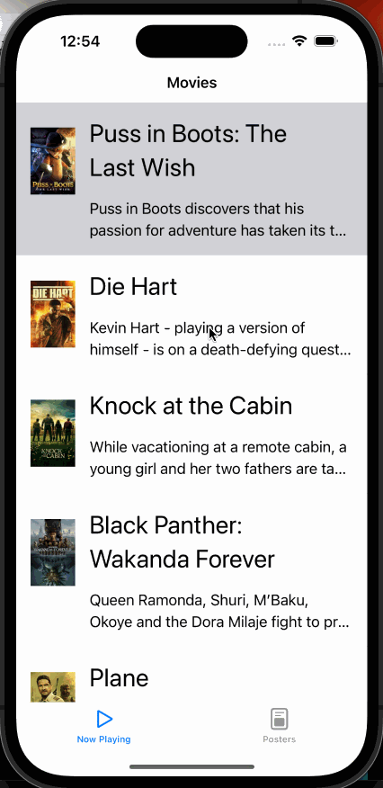

# Project 3 - Flixter

Submitted by: Tung Dinh

Flixter is an app that introduces current playing movies and browse movies from a poster collection view

Time spent: 9 hours spent in total for the entire project

## Required Features

The following **required** functionality is completed:

- [x] Implement network call and table view to display a list of movies currently playing (title, description, image)
- [x] App has a collection view with the same list of movies
- [x] Uses a tab bar controller to switch between collection view and table view screens
 
The following **optional** features are implemented:

- [ ] Make an additional network call to another end-point.    
- [ ] Allow users to scroll when context items are off-screen (table view implemention)

The following **additional** features are implemented:

- [ ] List anything else that you can get done to improve the app functionality!

## Video Walkthrough

Here's a walkthrough of implemented user stories:

<!-- Replace this with whatever GIF tool you used! -->
GIF created with LiceCap
<!-- Recommended tools:
[Kap](https://getkap.co/) for macOS
[ScreenToGif](https://www.screentogif.com/) for Windows
[peek](https://github.com/phw/peek) for Linux. -->

## Notes

Describe any challenges encountered while building the app.

## License

    Copyright [2023] [Tung Dinh]

    Licensed under the Apache License, Version 2.0 (the "License");
    you may not use this file except in compliance with the License.
    You may obtain a copy of the License at

        http://www.apache.org/licenses/LICENSE-2.0

    Unless required by applicable law or agreed to in writing, software
    distributed under the License is distributed on an "AS IS" BASIS,
    WITHOUT WARRANTIES OR CONDITIONS OF ANY KIND, either express or implied.
    See the License for the specific language governing permissions and
    limitations under the License.
