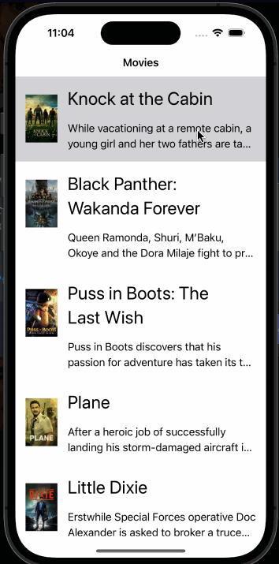

# Project 2 - Flixter

Submitted by: Tung Dinh

Flixter is a movie browsing app that display movies with description, votes, and popularity

Time spent: 4 hours spent in total

## Required Features

The following **required** functionality is completed:

- [x] Users are able to see a customized app icon and launch screen
- [x] Your app should work for any screen size and orientation using AutoLayout constraints
- [x] Mark here if you will demostrate auto layout implemention as horizontal rotation or different phone size or both, then erase this text
- [x] Displays at least 5 different movies in a table view
- [x] Can tap into detail view of movie with a full description, backdrop image, and title
 
The following **optional** features are implemented:

- [ ] Unique UI changes, such as background, font/color changes, etc.
- [ ] User implements a collection view
- [ ] User implemenets tab bar controller with at least two screens

The following **additional** features are implemented:

- [ ] List anything else that you can get done to improve the app functionality!

## Video Walkthrough

Here's a walkthrough of implemented user stories:

<!-- Replace this with whatever GIF tool you used! -->
GIF created with LiceCap
<!-- Recommended tools:
[Kap](https://getkap.co/) for macOS
[ScreenToGif](https://www.screentogif.com/) for Windows
[peek](https://github.com/phw/peek) for Linux. -->

## Notes

Describe any challenges encountered while building the app.

## License

    Copyright [2023] [Tung Dinh]

    Licensed under the Apache License, Version 2.0 (the "License");
    you may not use this file except in compliance with the License.
    You may obtain a copy of the License at

        http://www.apache.org/licenses/LICENSE-2.0

    Unless required by applicable law or agreed to in writing, software
    distributed under the License is distributed on an "AS IS" BASIS,
    WITHOUT WARRANTIES OR CONDITIONS OF ANY KIND, either express or implied.
    See the License for the specific language governing permissions and
    limitations under the License.
